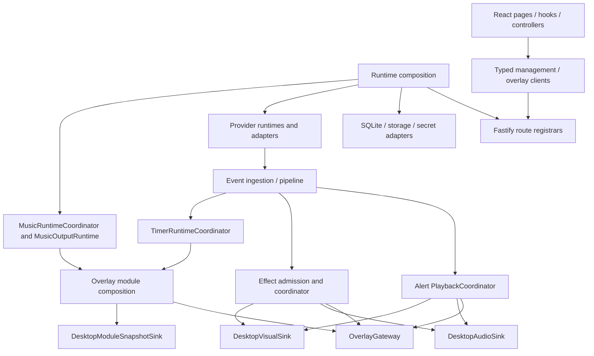

# Class and interface structure audit

Date: October 5, 2026. Baseline: `b1f505807bc2ece68792d0fa79214056fd348b57` on `codex/repair-error-taxonomy`, after the error-class repairs. This audit changes documentation only; it does not implement, commit or publish repairs.

Implementation follow-up: A1–A7 have been implemented on `codex/architecture-audit-repairs`. See the [execution ledger](2026-10-05-architecture-repair-progress.md) for source/test reconciliation and verification status. The observations below retain their original audited baseline.

The principal remaining problems are incomplete capability contracts, duplicated wire models, and misplaced persistence/shared-contract ownership. There is no evidence that a broad superclass hierarchy would improve this architecture. Seven actionable findings follow: three P2 and four P3. None establishes an urgent incident in the current production wiring.

## Findings

### A1 — P2: Some management wire contracts remain copied and unchecked

**Evidence:** [ManagementHttpClient](../../apps/web/src/management/management-http-client.ts#L29) lets callers choose an arbitrary `T`, then [asserts JSON as T](../../apps/web/src/management/management-http-client.ts#L170). Most newer domain methods parse shared core schemas, but [server/desktop/moderation settings](../../apps/web/src/management/management-api.ts#L799) and [diagnostics exports](../../apps/web/src/management/management-api.ts#L853) use the unchecked generic directly. Their interfaces are declared independently in the web client. The server's [DiagnosticsDebugExport](../../apps/server/src/modules/diagnostics/diagnostics-service.ts#L96) includes `runtimeLogSkippedCorruptRecords`; the [web copy](../../apps/web/src/management/management-api.ts#L218) does not.

**Confirmed behavior:** A disposable fake HTTP response `{ host: 17, port: "not-a-port" }` passes through the actual `createHttpManagementApi().getServerConfig()` implementation unchanged. It violates the method's declared result type. The omitted diagnostics field demonstrates type drift; this audit does not claim the existing JSON download drops that field.

**Impact:** Typechecking cannot catch producer/client drift for these methods. Malformed successful responses enter components as valid settings or exports, bypassing the boundary validation used by adjacent methods.

**Repair direction:** Make one browser-compatible schema/type authoritative for each exposed wire shape. Reuse existing core schemas where they describe the response exactly; otherwise introduce an explicit response projection. Parse `unknown` in each domain client. Keep the raw HTTP operation for binary transport, but avoid treating a generic return parameter as validation. Add wrong-type/missing-field response tests for settings and exports.

### A2 — P2: Optional mute capabilities allow false success

**Evidence:** [OverlayPlaybackInstructionSink](../../apps/server/src/modules/playback/playback-coordinator.ts#L57) makes both mute methods optional. [applySafetyState](../../apps/server/src/modules/playback/playback-coordinator.ts#L480) uses optional chaining for browser mute, whereas it explicitly rejects a present audio sink lacking module mute. [DesktopAudioTransport](../../packages/core/src/audio/transport.ts#L52) also makes module mute optional; [runtime initialization](../../apps/server/src/runtime/runtime-composition.ts#L528) silently skips it, while [DesktopAudioSink.setModuleMutes](../../apps/server/src/modules/audio/desktop-audio-sink.ts#L164) later requires it.

**Confirmed behavior:** A TypeScript probe accepts a browser sink implementing only `deliverPlaybackInstruction`. A disposable instance of the verified built PlaybackCoordinator accepts that sink and resolves `applySafetyState` with both modules muted, without issuing any mute operation or reporting unsupported capability. The current production OverlayGateway, AudioHost and WorkerAudioClient provide the methods; this is a contract/substitution gap, not evidence that those adapters currently fail to mute.

**Impact:** A contract-conforming replacement or test double can report successful safety controls without applying them. The desktop contract similarly permits an implementation that boots successfully but later rejects module mute.

**Repair direction:** Separate a basic delivery port from the production safety-capable port, or make the required safety operations mandatory for configured production outputs. Keep absence of an entire output supported. Validate capabilities before admitting a configured output and fail explicitly for unsupported mute. Add minimal-substitute negative tests. Preserve intentional preparation/play compatibility; this finding does not require making every optional playback operation mandatory.

### A3 — P3: Provider management depends on a nominal SQLite implementation

**Evidence:** [ProviderManagementServiceOptions.repository](../../apps/server/src/modules/providers/provider-management-service.ts#L58) and its private field require the complete `SqliteProviderRegistrationRepository`. The [implementation](../../apps/server/src/modules/providers/sqlite-provider-registration-repository.ts#L56) owns private connection/clock/synchronous lookup fields and also owns the record/result interfaces. Other consumers already use narrow `Pick` projections of it.

**Confirmed constraint:** A TypeScript probe implementing every public repository method still cannot satisfy this dependency: it lacks `#connection`, `#now`, and `#findByIdSync`. The probe receives precisely that private-member diagnostic. Provider service tests currently instantiate the concrete SQLite repository; those integration tests remain useful.

**Impact:** The service depends on implementation identity rather than its persistence contract. A substitute store or focused failure-injection fixture needs a concrete instance or an assertion. Changes to persistence implementation also own otherwise neutral service-facing records.

**Repair direction:** Define a server-side ProviderRegistrationRepository port and neutral record/result types. Have the SQLite class implement that port and use narrow projections in consumers. Preserve the domain-specific transactional activation/deactivation and credential behavior; do not replace them with generic CRUD or remove useful SQLite integration tests.

### A4 — P2: Timer credential service combines credential policy and SQL ownership

**Evidence:** [TimerAutomationCredentialService](../../apps/server/src/modules/timers/timer-automation-credential-service.ts#L15) requires a native DatabaseSync connection, writes the credential row in [createOrRotate](../../apps/server/src/modules/timers/timer-automation-credential-service.ts#L48), performs revocation SQL, and [reads/parses persisted rows](../../apps/server/src/modules/timers/timer-automation-credential-service.ts#L88). The same class owns token generation, format policy, hashing and constant-time verification. By comparison, AutomationCredentialService receives an AutomationGrantRepository.

**Impact:** This bypasses the repository invariant used elsewhere in the application. Persistence mapping/transaction changes and credential policy changes share one owner; policy cannot be isolated from SQLite when testing failure and replacement behavior. This audit found no credential leak or verification bypass.

**Repair direction:** Introduce a small timer credential repository with atomic issue/rotate, revoke and read operations; move SQL and row mapping into its SQLite implementation. Keep token policy and timing-safe comparison in the service. Preserve singleton semantics, verifier-only storage, first-created timestamp, idempotent revocation and atomic rotation. Keep timer automation credentials separate from scoped automation pairing/grants.

### A5 — P3: Music artwork capabilities exist outside the source adapter contract

**Evidence:** The core [MusicSourceAdapter](../../packages/core/src/music/types.ts#L31) specifies connection, snapshots, start and stop. [MusicRuntimeCoordinator](../../apps/server/src/modules/music/music-runtime-coordinator.ts#L69) locally asserts intersections containing optional `getArtworkPolicy` and `getArtworkDescriptor` methods. [PearMusicSource](../../apps/server/src/modules/music/pear-music-source.ts#L40) implements those extra methods, but the factory contract neither names nor verifies the server-private capability.

**Impact:** A source can publish an artwork reference while satisfying the public adapter interface and omit or mistype the private resolver capability. The coordinator then returns null through an implicit fallback, or can encounter an incompatible method. Correct artwork integration depends on conventions outside the factory's type contract.

**Repair direction:** Define a server-private artwork capability beside the server adapter factory, with explicit optional capability ownership and a typed resolver/policy pair. Bind it through construction or a discriminated adapter capability. Keep URLs, trust policy and credentials out of browser-compatible/public snapshots. Retain valid artwork-free sources and fail-closed behavior.

### A6 — P3: Shared playback ports and occurrence identity are owned by sibling coordinators

**Evidence:** Effects import [OverlayPlaybackInstructionSink and DesktopVisualPlaybackSink](../../apps/server/src/modules/screen-effects/effect-playback-coordinator.ts#L14) from the Alert PlaybackCoordinator implementation module. In the other direction, [PlaybackCoordinator](../../apps/server/src/modules/playback/playback-coordinator.ts#L26) imports `effectOccurrenceKey` from EffectPlaybackCoordinator. The [identity function](../../apps/server/src/modules/screen-effects/effect-playback-coordinator.ts#L69) already accepts any module ID and is used by Alerts, Effects admission and runtime release wiring.

**Impact:** Shared contracts are owned by whichever sibling introduced them first. This creates mutual source dependencies and gives a neutral media ownership key an Effects-specific owner. The return dependency on playback ports is type-only; this audit does not claim a runtime initialization cycle.

**Repair direction:** Move the transport ports and module occurrence identity into neutral playback modules, without changing the encoded identity or media-release behavior. Keep both coordinators independent and share only proven common operations. A common coordinator superclass would couple their distinct admission, queue and completion policies unnecessarily.

### A7 — P3: Screen Effect editor requests the entire management interface

**Evidence:** [ScreenEffectEditorProps.managementApi](../../apps/web/src/management/screen-effects/ScreenEffectEditor.tsx#L44) and its loaders accept the full ManagementApi, but use only asset listing, Twitch status/rewards, provider listing/subscriptions and optional duration repair. Its [test fixture](../../apps/web/src/management/screen-effects/ScreenEffectEditor.test.tsx#L476) supplies five methods then uses `as unknown as ManagementApi`. Adjacent editors/pages already use narrow `Pick` projections.

**Impact:** The declared dependency overstates the editor's needs while its fixture opts out of enforcing them. Adding an unrelated management operation changes this editor's formal contract; adding a new editor dependency can still leave the fixture missing it at runtime.

**Repair direction:** Introduce a narrow ScreenEffectEditorManagementApi projection, treating optional duration repair explicitly. Use it in props, context loaders and fixtures, and replace the double assertion with a checked fixture (`satisfies` or a declared narrow return type). Keep asset/audio/domain clients separate.

## Inventory and relationships

The AST inventory covers 468 `.ts`/`.tsx` source files under the four package/application source roots, excluding named test, spec and story entrypoints and declaration files, but including supporting modules in test-support and story directories. It records declarations, source locations, direct `extends`/`implements` clauses and member names. It is a declaration inventory, not a count of all React components, functions, type aliases or Zod-inferred contracts. Manual tracing concentrated on the listed boundaries and findings; 992 declarations were not each reviewed line by line.

A subsequent [simplicity and consistency audit](./2026-10-05-simplicity-and-consistency-audit.md) adds S1–S5 without replacing these findings.

| Source root | Classes | Interfaces |
| --- | ---: | ---: |
| packages/core/src | 39 | 240 |
| apps/server/src | 181 | 324 |
| apps/web/src | 4 | 169 |
| apps/desktop/src | 13 | 22 |
| Total | 237 | 755 |

Of the classes, 101 are errors and 136 are other classes. Seventy-four class declarations explicitly implement interfaces; 55 interface declarations extend others. Structural assignments also enforce ports, so absence of an explicit `implements` clause alone is not a finding. Outside errors, the only class `extends` declaration is ManagementErrorBoundary extending React Component. The previously repaired error hierarchy is not reopened by this audit.

Full inventory: [992 class/interface declarations](2026-10-05-class-interface-inventory.csv).

### Core and persistence

| Contract / family | Implementations and consumers | Relationship |
| --- | --- | --- |
| AlertMatcher / AlertResolver / AlertService | DefaultAlertMatcher, DefaultAlertResolver, DefaultAlertService; PlaybackCoordinator and editor/service paths | Implement interface; constructor composition |
| AlertRepository and authoring repository ports | SQLite alert/rule, document, set and aggregate mutation implementations | Persistence adapters implement explicit contracts |
| ScreenEffectRepository / ScreenEffectSetRepository | SqliteEffectRepository / SqliteEffectSetRepository; management and admission | Explicit domain persistence ports |
| AssetRepository / MediaAssetStore / AssetValidator / MediaMetadataProbe | SqliteAssetRepository, LocalAssetStore, DefaultAssetValidator, MusicMetadataProbe | Import/library/media services compose validation, metadata, persistence and storage |
| PlaybackQueue / EffectQueue | DefaultPlaybackQueue / DefaultEffectQueue | Independent policies; QueueOwner adapters normalize operator operations |
| TemplateRenderer | DefaultTemplateRenderer and SafeTemplateRenderer | Safe renderer decorates a renderer through composition, then moderation |
| ModerationService / TtsService / TtsProvider | DefaultModerationService, DefaultTtsService; BrowserSpeechTtsProvider and SpeakerBotTtsProvider | Service composes a registry and provider ports |
| OverlayModuleRegistry / OverlayModuleRuntime | StaticOverlayModuleRegistry; TimerRuntimeCoordinator, MusicOutputRuntime, structural Alert/Effect runtime adapters | Module definitions/config and output snapshots have separate ownership |
| SecretStore / OsCredentialAdapter | DevSecretStore, OsSecretStore, KeyringCredentialAdapter | Store delegates platform credential operations |
| Logger | RuntimeJsonlLogger | One runtime writer; diagnostic queries depend on read/log ports |

### Runtime and UI composition

Arrows denote composition or calls, not inheritance. ProductionServerAppDependencies already requires the main production route dependency assembly, and route registrars generally consume narrow ports. The previous large delegating management facade has already been replaced with domain registrars and ManagementOverviewService. The core layer projector, output readiness service, preview controller and shared authenticated asset transport from the earlier complexity audit are present; those historical findings are not reported again.

### Desktop isolation

WorkerAudioClient and AudioHost implement DesktopAudioTransport at different process boundaries. WorkerOverlayClient and OverlayHost similarly implement DesktopOverlayTransport. ServiceSupervisor consumes narrow supervised host interfaces. The ports deliberately differ because ownership, leases, rendering, display selection and terminal cleanup differ. The shared transport schemas, media grants and recipient ledger are already reused.

## What should be shared, and what should remain independent

- Share the remaining authoritative wire schemas/types, safety capability contracts, provider persistence port, timer credential repository, server-private music artwork capability, neutral playback ports/identity, and editor dependency projection.
- Retain interface implementation and composition for repositories, provider adapters, storage/security adapters and UI controllers. Similar lifecycle method names do not establish substitutability.
- Retain separate Alert and Effect queues/coordinators. Alert enqueue resolves matched rules, generates occurrences and can immediately advance; Effects validate admitted snapshots, enforce pending capacity and advance explicitly. Their timestamp models, replay policies and terminal outcomes differ. Share exact pure mechanics only where an independent change demonstrates useful reuse.
- Retain separate audio and visual hosts and credential systems. Generic Repository, BaseProvider, BaseModule, BaseCoordinator or BaseWindow classes are not justified by this audit.
- Keep React pages as functions and hooks/controllers. Turning them into classes would not address contract width or domain ownership.

## Verification and limits

- Inventory produced by the installed TypeScript AST parser; all 992 rows include real source paths and one-based declaration lines.
- Duplicate interface names, class heritage, concrete repository consumers, direct SQL in services, optional playback capabilities and frontend type assertions were searched across the current source roots.
- Disposable runtime probes exercised the actual frontend methods transpiled from current source and the existing verified built PlaybackCoordinator. They used fake HTTP data and an empty in-memory queue; they contacted no external service or normal profile and disposed the coordinator.
- A source-resolved TypeScript probe accepted the mute-less sink and rejected a complete public-method provider repository substitute solely because of private implementation members.
- The differing diagnostic export members were confirmed from current declarations. Adjacent schema-validated methods and already-resolved historical findings were checked to avoid overstating the gaps.
- No product code changed, so the previous implementation gates were not rerun or represented as new audit validation. No physical desktop, OBS, external provider, remote CI or exhaustive behavioral/security acceptance was performed.

Suggested repair order: A2 safety capability contracts; A1 wire contracts; A4 timer credential persistence; A3 provider repository port; A5 private artwork capability; A6 shared playback ownership; A7 editor projection. Each can be a focused slice, preserving current public behavior and adding contract-specific negative tests.
