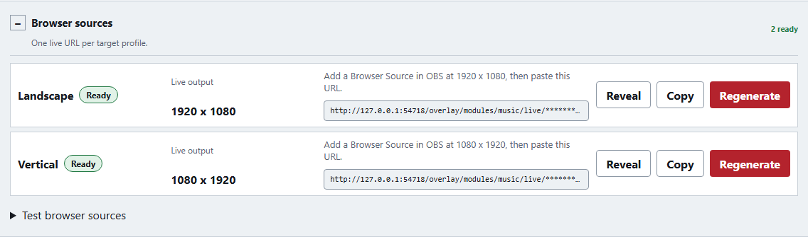
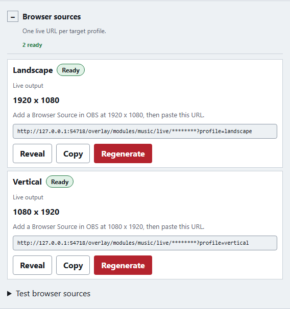

## Independent desktop placement checkpoint (2026-10-04)

Music now includes a Desktop overlay placement disclosure with a production-renderer preview on the 1920×1080 logical canvas. Users drag the whole widget, edit exact X/Y coordinates or use arrows (Shift = 10 px), with independent grid/alignment toggles and transient edge/center guides. Escape restores the starting position. Full/compact desktop positions save independently; Reset and older configs retain alignment. Widget-size changes clamp positions. The private recipient applies desktop coordinates; browser output stays independent. Desktop state, display, enablement and Music visibility are visible with shared Overlay settings, explicit CSS guards and stale-status recovery. Opening this editor does not enable output.

Focused core/server/editor/private-renderer tests passed **51/51**; backup and positioned private-renderer rechecks passed **14/14**. Actual built-service desktop transport/browser isolation and graphical widget-size workflows passed **2/2**. The final placement workflow recheck and visual inspection passed **1/1**, including a 390px layout. Scoped production Storybook interaction/accessibility/console checks passed **4/4**, including ready, disabled, failed-status and custom-CSS states. Root/E2E/desktop TypeScript, changed-file ESLint, error provenance, strict active OpenSpec validation, web/private-overlay builds and route budgets passed. Canonical Music placement requirements and the 70-scenario trace are synchronized.

The runnable candidate is `apps/desktop/out/music-placement/Stream Jams-win32-x64`. A packaged disposable-profile check exercised keyboard movement, numeric save and reload, then exited cleanly. Its first immediate value assertion raced React rendering; awaited Playwright assertions passed without changing product behavior. The normal user app is still running the earlier package and was not replaced or interrupted. Authenticated installed-Pear/OBS/physical-display acceptance remains separately pending.

## Graphical widget size checkpoint (2026-10-04)

Music preview includes an independent Resize widget mode, outer corner handle and matching width/height inputs. Dragging respects grid snapping; arrows adjust by 1 px or 10 px with Shift. Escape, pointer cancellation and lost capture restore the initial appearance. Dimensions respect schema and output-profile bounds. Shrinking fits insets and existing component rectangles without changing fonts; automatic layout remains automatic. Changes stay in the current profile/view draft until Save. Custom CSS disables native size handles.

Focused editor, geometry and Music page tests passed **17/17**. Built-service resizing save/reload plus existing Music/Alerts snapping Playwright passed **3/3**. The new Storybook resize interaction/accessibility scenario passed **1/1**. Web/E2E TypeScript, scoped ESLint, error provenance, production web/Storybook builds and route budgets passed.

The desktop candidate was built in `apps/desktop/out/widget-size/Stream Jams-win32-x64` to preserve the running user app. A disposable packaged-profile check exercised Resize widget and exact keyboard width changes, reset the draft and exited cleanly. Switching the normal app to this candidate awaits the user closing the current app; the running original package was not replaced.

## Browser Sources presentation checkpoint (2026-10-04)

Alerts, Screen Effects, Timers and Music now share `BrowserSourcesPanel`, based on the Alerts compact band. The boxed disclosure icon, typography, padding, summary colors and responsive header are shared; each module retains its output setup controls. Screen Effects source-list styling follows the shared panel. Summary markup now uses an accessible group role, including empty output states.

Affected module unit tests passed **72/72**. Web/E2E TypeScript, scoped ESLint, error provenance, production web build and route budgets passed. Built-service Playwright passed **1/1**, comparing all four panels at 1280 and 390 pixels and exercising Enter/Space expansion/collapse with no panel overflow. Storybook production build and scoped interaction/accessibility checks passed **5/5** (collapsed, expanded, empty, refresh failure and narrow states).

After the user closed the app, the Windows folder was repackaged. Packaged Music startup, native DLL loading and utility-worker lifecycle checks passed **3/3** in disposable profiles. The normal app was restarted with `NODE_EXTRA_CA_CERTS` pointing to the Pear public certificate; `/health` returned `ok`, and the running service served the new shared Browser Sources CSS.

# Music widget module verification

## Shared snapping checkpoint (2026-10-04)

The approved refinement is implemented in Music and Alerts with independent default-enabled **Snap to grid** and **Snap to alignment** controls. One framework-independent management helper snaps pointer gestures to a 10-pixel grid or the nearest visible peer/canvas edges and horizontal/vertical centers. Alignment tolerance is five screen pixels at the current zoom; nearest alignment wins before grid. Resize anchors and per-editor minimum sizes remain bounded. Hidden, audio, speech, self and other-profile peers are excluded. Active guides are pointer-inert and clear after a gesture; manual and keyboard edits bypass snapping. Preferences do not dirty saved documents.

Affected validation:

- Shared geometry, Music gestures, Alerts gestures and legacy editor-state suite **38/38** passed. Final resize-anchor/center correction recheck **18/18** passed; nonvisual speech peer regression **8/8** passed.

- Management route suite **32/32** passed; Music page **11/11** passed. The first cold lazy-route test raced Vite's module transform; routing test setup now preloads the real editor without changing its assertions.

- Actual built-service Playwright: Music/Alerts snapping and existing Music editor workflow **3/3** passed. Expanded move/resize assertions for both editors subsequently passed **2/2**; free movement, peer priority, transient guides, exact keyboard changes and saved/reloaded rectangles were observed.

- Static Storybook build and tagged Chromium interaction/accessibility checks **2/2** passed. Final speech-target filtering was then covered by the focused canvas regression and rebuilt production bundle.

- Root, E2E and desktop TypeScript builds, scoped ESLint and error provenance passed. Web and private-overlay builds passed. The initial management budget failure (250.49 KiB) was resolved by loading AlertEditorPage only on its route, with an accessible loading state. Final gzip budgets: bootstrap 68.42/100 KiB, overlay 140.86/150 KiB, operator 131.62/175 KiB and management 209.93/250 KiB.

The runnable Windows folder was rebuilt with the verified cached Electron distribution. Packaged Music snapping controls/no-source/safety, native loader and worker lifecycle checks passed **3/3** in disposable profiles and exited cleanly.

The shared snapping capability is synchronized, and BL-016 retains only responsive units/custom profiles/cross-profile assistance. This local checkpoint does not claim a full repository suite, remote CI or the remaining physical Pear/OBS acceptance.

## Editor refinement checkpoint (2026-10-04)

The user-requested refinement aligns Music with Alerts: Browser sources first, preview next, then independent Configuration and Custom CSS disclosures. Alerts' RGB/opacity control is paired with validated RGBA input. Native per-component rectangles are saved per profile/view; management-only pointer handles and keyboard/numeric controls use bounded core geometry, while live browser/unified/private-desktop renderers consume the same projection. Old configurations and automatic reset use `componentLayout: null`. Nonempty enabled CSS explicitly disables native visual editing; the recovery button remains beside the preview.

Validation on the current build:

- Focused Music core/management/renderer and backup suite: **125/125** passed; final geometry/projection/editor/backup recheck **20/20** passed after gesture refinements.

- Root, E2E and desktop TypeScript project builds passed. Scoped ESLint and error-provenance checks passed.

- Web and private desktop overlay builds passed. Gzip route budgets: bootstrap 68.39/100 KiB, overlay 139.59/150 KiB, operator 131.59/175 KiB, management 249.89/250 KiB.

- Static Storybook build and tagged Chromium interaction/accessibility checks: **10/10** passed. The first static run exposed a story assertion racing React's effect-driven hex synchronization; assertions now await the visible value.

- Actual built-service browser tests: new editor **1/1**, CSS/branding/security **2/2**, existing Music integration **10/10** passed. Real mouse drag/resize, keyboard movement, draft-only edits, save/reload/live geometry without guides, CSS recovery and automatic reset are covered. An overlap failure was fixed by placing the selected component above other handles; its real mouse regression passed.

- Four-view backup round trip now includes manual component rectangles. Core tests cover older defaults, invalid geometry, resize bounds and narrow output projection.

The desktop runnable folder was rebuilt with the existing native DLL unpack policy and verified cached Electron distribution. Packaged Music editor/no-source/safety check **1/1**, native loader and bundled worker checks **2/2** passed. The first Music run reached all assertions but its intentionally dirty preview draft blocked shutdown; the test now restores automatic layout before quitting. Only its identified disposable process was terminated, and the corrected run exited cleanly. This refinement does not claim physical paired Pear approval, OBS pixels or active private-desktop Music acceptance; the previously recorded physical boundary remains pending. No full repository suite or remote CI rerun is claimed for this local refinement.

## Packaged startup correction (2026-10-04)

The user's launch with `NODE_EXTRA_CA_CERTS` exposed a packaging regression. The desktop emergency log recorded service-worker exit 1 before the management window. The real packaged-worker harness captured `ERR_DLOPEN_FAILED` while importing Sharp: its `.node` addon was unpacked, but companion `libvips-42.dll` and `libvips-cpp-8.18.7.dll` were inside ASAR. Windows cannot resolve those virtual files. The earlier startup timeouts cannot be attributed to `LockApp`; its presence alone does not establish a locked session, and the user confirmed active desktop use.

Forge now unpacks both `.node` and `.dll` files. The new real-artifact regression first failed on the missing `libvips-42.dll`; the rebuilt package contains both DLLs beside the addon. With `NODE_EXTRA_CA_CERTS=C:\StreamingTools\pear-desktop\localhost.crt`, the packaged DLL check, owned-worker start/persisted-mute/stop check, and Timer desktop lifecycle check passed. The first combined run was **3/4**: Music reached management, then its fixture incorrectly expected an overlay window with no renderable content. A silent timer now provides the lazily created surface without weakening Music absence, safety, opt-in or focus assertions. The subsequent fixture run found its final settings PUT included read-only status fields; an explicit settings projection fixed that test defect. The final focused Music run passed **1/1**. No production overlay behavior changed.

Commands: `tsc -b tsconfig.json`, `node scripts/stage-desktop.mjs`, `node scripts/package-desktop.mjs`, then `playwright test --config playwright.desktop.config.ts tests/desktop/utility-worker.spec.ts tests/desktop/music.spec.ts tests/desktop/timers.spec.ts --reporter=line`; the corrected Music fixture reran separately. Packaging's download route hit sandbox `EACCES` and later stalled; a staging-only Forge `electronZipDir` option used the already-installed exact Electron 44.4.4 ZIP. That local cache path is not a production configuration change. The rebuilt executable remains at `apps/desktop/out/Stream Jams-win32-x64/Stream Jams.exe`.

Read-only validation of the user's configured Pear API confirmed `AUTH_AT_FIRST`, HTTPS and its certificate path. TLS 1.3 and hostname validation succeeded for `localhost` and `127.0.0.1` with explicit trust; unauthenticated REST returned 401, and WSS closed with 1008. A fresh standalone Node process using only `NODE_EXTRA_CA_CERTS` also returned 401 over validated HTTPS. This does not certify an authenticated Electron pairing/session: real paired playback, OBS pixels and active private Music artwork/font/rendering still require their remaining acceptance. OBS was observed running and the user confirmed Windows is unlocked. No production profile, shared keyring, Pear settings or OBS source was changed by this correction.

## Final correction wave after Checkpoint 16 (2026-10-04)

The four Important review findings are closed in the current implementation: normal Music revisions keep one renderer host and its shadow CSS/font/animation nodes; numeric and date `Retry-After` values above one minute are honored with cancellable timer chunks; production Music output work keeps one active and one latest pending synchronization with one rejection observer per pending promise, carrying explicit test/config refresh forward; and complete Pear registration, credential replacement and source selection lifecycles hold the runtime maintenance intake gate. Restore returns an actionable HTTP 409 while admitted Music work is active, then succeeds on retry; a failed restore excludes a concurrent replacement and retains the rollback credential. See the [scenario trace](music-widget-scenarios.md) for executed evidence. The Checkpoint 16 section below is preserved as a historical pre-fix record.

The built-service Chromium fixture now passes provider artwork through the actual Pear adapter, injected in-process raster bytes, Sharp decode/cache, output-scoped grant and browser image decode. It also verifies old artwork-reference denial after a source switch. The injected transport exercises the post-fetch path; production DNS pinning, TLS and address restrictions remain covered by their direct security tests, and installed Pear HTTPS artwork remains unobserved. Current built-service Music E2E is **12/12**; the affected renderer Storybook Chromium stories pass **9/9**.

The gate chronology matters because the last bounded-output-observer correction followed the complete suite. At the Task 16 checkpoint, whole-repo lint, provenance, full TypeScript references, 96/96 Node script tests, production web/desktop-overlay builds and route budgets, full Storybook build and built-preview runner **305/305**, standard non-Music E2E **73/73**, and then-current built-service Music E2E **7/7** passed. The first full Vitest run was **2877/2880** because three expectations predated the Music module and migration 031; corrected fixtures passed their focused **19/19** rerun. At correction commit `d61060c`, `vitest run` passed **2890/2890 across 331 files**. The production web/desktop-overlay builds and route-budget check passed (bootstrap **68.39/100**, overlay **138.95/150**, operator **131.19/175**, management **249.27/250 KiB** gzip); affected Storybook passed **9/9**, and built-service Music E2E passed **12/12**. At final observer commit `2e2cd99`, focused runtime/desktop-output tests passed **10/10**, TypeScript, scoped lint and provenance passed, and the actual rebuilt-service Music E2E passed **12/12** again. The full 2890-test suite was not rerun after that isolated two-file observer correction; these affected checks and the rebuilt browser path are the final-head evidence. Corepack's shared Windows cache returned `EPERM`, so equivalent installed workspace binaries ran these gates. Storybook's full manager build required sandbox access to its user cache. The [implementation decisions](music-widget-decisions.md) record the final rationale and costs.

The active delta's nine source requirements and twelve widget requirements, including all 57 named scenarios, are now synced into the [canonical Music source](../../openspec/specs/music-source-providers/spec.md) and [widget/output](../../openspec/specs/music-widget-overlay/spec.md) capabilities. This is a software contract reconciliation, not a physical acceptance claim. The [scenario trace](music-widget-scenarios.md) records tests and remaining installed-app/private-desktop observations. BL-028 remains open for those physical checks; BL-054 remains future provider work. The historical pre-fix checkpoint below retains the status observed at that time.

Read-only physical inspection confirmed installed Pear Desktop/Youtube Music **3.12.0**, a loopback API listener and installed OBS **32.2.2**. A credential-free REST `/api/v1/song` probe returned 200 and a credential-free WS probe yielded one message before termination; these do **not** establish `AUTH_AT_FIRST` enforcement or an authenticated session. OBS was inactive, and `LockApp` blocked packaged window checks. Actual Pear approval/restart/revocation and OBS pixels therefore remain **[blocked]**, as do private desktop pixels/input/audio/art/font/shutdown checks until Windows is unlocked and an isolated native-host SecretStore or authorized disposable keyring namespace is available. No production Pear settings, shared keyring, user profile or OBS source was changed.

## Checkpoint 16: implementation reconciliation (2026-10-04)

Music is now a disabled-by-default native module with a Pear adapter, management workflow, shared browser renderer, authorized module/unified output, validated styling and branding. The [provider guide](../music-providers.md), [styling guide](../music-styling.md), [checked CSS example](../examples/music-branding.css), and [57-scenario trace](music-widget-scenarios.md) describe the current behavior and remaining acceptance. This checkpoint is not a final acceptance claim: the independent whole-branch review found four important issues involving long marquee remounts, `Retry-After` delays over one minute, an unbounded Music output queue, and concurrent registration during restore. They are reserved for the next fix wave.

The current checkout passed provenance, lint, all TypeScript project references, all 96 Node script tests, production web and desktop-overlay builds, strict change validation, full Storybook build, its built-preview Chromium runner (305/305), 73/73 standard non-Music Chromium E2E tests, and 7/7 built-service Music Chromium E2E tests. The first full Vitest run reached 2877/2880 assertions; three failures were stale test expectations after registering Music and adding migration 031. Their focused rerun passed 19/19 after correcting the fixtures; a full rerun is reserved for the review fixes. Gzip route budgets passed: bootstrap 68.39/100, overlay 138.90/150, operator 131.19/175, management 249.22/250 KiB. The local Task 16 report records exact commands, classification, and scope.

The built-service browser acceptance now covers a branded management preview, an uploaded custom font, checked CSS, transparent brand layer and foreground opacity, contain/cover/fill, content positioning, image replacement, failed-image fallback, idle/empty clearing, module/unified output and backup restore. Real provider artwork delivered through the browser remains unobserved: unit and service tests exercise TLS/address policy, Sharp decoding and authorized routes, but this fixture has no in-process artwork-fetch injection seam. The review fix wave will add a typed test seam and exercise the real cache/grant/browser-image path. Full/compact per-profile visual combinations are not exhaustively asserted by the browser test; the schema, editor, backup and renderer tests cover their state boundaries.

**[blocked] Physical acceptance:** no installed Pear Desktop version or `AUTH_AT_FIRST` setting was observed; no real Pear pairing, restart, revocation, track/pause/seek/reconnect or OBS browser source was exercised. The packaged desktop Music and Timers comparison timed out before the first management window while Windows `LockApp` PID 10612 was active. An unlocked interactive Windows session is required. Active private Music also needs an isolated native-host secret-store harness or authorized disposable keyring namespace; the packaged worker currently uses the shared keyring prefix. Private desktop pixels, input/focus, audio silence, authorized art/font rendering and shutdown clearing remain unverified. The Task 15 staging check did successfully import native `sharp` and decode a complete generated PNG from the packaged dependency closure, but that is not a window test. No production Pear settings, user profile or shared keyring was changed.

BL-028 remains in the backlog. Canonical Music spec sync is deferred until the known review gaps and viable artwork-browser acceptance are fixed, so the main specs do not claim unfinished behavior. BL-054 remains separate future Plex/Spotify work. No change archive, push, PR or merge occurred.

## Checkpoint 1: baseline and dependency feasibility (2026-10-04)

This checkpoint prepares primitives only. Music remains unimplemented: the default module registry lists Alerts, Screen Effects and Timers; `providerKindSchema` has no Pear kind. Controller refreshed origin before dispatch; current `origin/main` is `1d9dfe7e5b2ad5f2241f9a63673ca2815c86dd57`, proposal HEAD `ddbb2507c68893581d23ccd86a52ca919dbe518f`, branch `codex/add-music-widget-module`; starting tracked tree was clean. Standalone reference HEAD was verified as `91dcee0327eb97a75860a892a92630c32e0f9e3e`. No standalone files changed. Supported Pear protocol baseline remains 3.12.0; this checkpoint does not certify a running Pear installation.

### Reference feature map

| Reference behavior/source | Native destination and required adaptation |

| --- | --- |

| `pearYoutubeMusicSource.js`: auto, WS, 3-second polls, fallback | Pear server adapter; authenticated transport selection, serialized polls, authoritative reconciliation, cancellation/generation ownership |

| `playerState.js`: title/artist/album, same-track merge, artwork | Bounded complete MusicSnapshot, ordered artists, nullable album, opaque server artwork reference; never reuse old-track optional metadata |

| `progressClock.js`: interpolation, paused freeze, seek/clamp | Core position projection in milliseconds with shared clock; unknown duration remains null, no fabricated zero total |

| `overlayView.js` and `overlay.css`: artwork/placeholder, title/details/progress/time | One React MusicWidget for preview, browser and desktop with typed asset resolver and transparent failure |

| `overlayConfig.js`, CSS: full/compact | Saved per-profile/per-view defaults: full 640x178/art144/padding16/gap22; compact480x118/art0/padding14x18/title22/details14 |

| Dark/light and opacity | Native theme presets, saved overrides, 84% default; independent image opacity |

| Eight alignment values | top-left/center/right, center-left/right, bottom-left/center/right; default bottom-left |

| Overflow scrolling and reduced-motion media rule | Shared renderer measurement, managed reduced motion; stable wrapping/clipping when reduced |

| `overlayApp.js`: idle none/hide/compact, 1..600 seconds | Core projection from server appearance epoch; default none/30seconds; new track/genuine recovery resets, polling/pause does not |

| `mockMusicSource.js`, setup connection test | Pure fixture preview and existing explicit test-purpose output; preview never starts adapter, test connection never activates |

| Optional document custom stylesheet | Versioned Advanced CSS with shadow-root local selectors, AST policy, animation namespacing; no automatic standalone stylesheet import |

| Standalone lacks branding/fonts and pairing | Existing asset and SecretStore integration; managed fill/image/content ordering, fresh pairing after restore |

Three previously reproduced standalone defects are required regressions, not compatibility: HTTP204 retaining the old playing track; an outstanding poll publishing after disconnect; repeated polling `connected` events resetting idle. The source audit previously ran 21 focused tests; those historical results were not rerun or claimed as new evidence here.

### Guidance and reuse boundaries

Reviewed frontend routing (guide, UX Integrations/Assets/Target Profiles/Diagnostics/Backup sections, UI guidelines, tokens, overlay-error rule), approved Music design/specs, module-config persistence, runtime secret storage and configuration backup/restore. Provider registration remains separate from live status; selection/test/save semantics must stay explicit. Music defaults disabled; CSS and branding are schema-backed config. Credentials stay server-only in durable SecretStore. Backups enumerate every profile/view font/image reference, exclude identity/credentials/cache/live playback and require fresh pairing. Preview/debug may explain errors; live outputs stay transparent.

### Exact dependency decisions

- Core runtime: **css-tree 3.2.1**, MIT, pure JS with ESM/browser builds and Node support compatible with Node24; core dev: **@types/css-tree 3.2.0**. [Official parser](https://github.com/csstree/csstree/blob/master/docs/parsing.md), [project and builds](https://github.com/csstree/csstree), [changelog](https://github.com/csstree/csstree/blob/master/CHANGELOG.md). Current npm metadata queried October4. Active changelog and detailed AST/custom-property handling suit the shared browser/Node policy. [Security page](https://github.com/csstree/csstree/security) lists no published advisories and no security policy; that is not proof of safety. Parser is not a sanitizer. Enable positions and parseCustomProperty; reject all Raw nodes/recovery errors; CSS identifier escapes remain escaped in AST names and must be decoded before policy comparisons. Walk custom values and var fallbacks/references, enforce limits and property/selector/at-rule policy separately.

- Server runtime: **sharp 0.35.5**, Apache-2.0, built-in TypeScript types, Node>=20.9, Windows x64 prebuilt native optional dependencies. Existing DefaultAssetValidator only checks MIME/extension/signature/bytes (10MiB uploads); MusicMetadataProbe only measures audio duration. Neither proves raster decoding or dimensions. [Sharp constructor](https://sharp.pixelplumbing.com/api-constructor/) supports metadata, strict decoding and pixel limits. Use PNG/JPEG/WebP signature admission before decoding, metadata format/side checks, limitInputPixels4096², failOn warning and actual decode; metadata alone is insufficient. [Security policy/history](https://github.com/lovell/sharp/security) documents native dependency advisories and continuous fuzzing; [September2026 librsvg advisory](https://github.com/lovell/sharp/security/advisories/GHSA-wq5f-xc86-pv6w) is patched in0.35.5. Reject SVG before decoder; avoid global loader configuration affecting other modules. Native footprint is justified by actual decode integrity rather than hand-written headers. [image-size](https://github.com/image-size/image-size/security) was rejected: archived June2026, header-only inspection, and prior infinite-loop DoS history. No global upload-policy change.

- Safe remote fetch: **no added dependency**. Node `https.request` accepts custom `lookup` through standard connection options ([HTTPS docs](https://nodejs.org/api/https.html), [Net lookup](https://nodejs.org/api/net.html#socketconnectoptions-connectlistener)). Resolve approved host, validate all returned IPs, then supply only validated chosen address(es) to lookup on a fresh non-pooled request. Preserve hostname/SNI and ordinary TLS verification; never use lookup-before-global-fetch as proof of pinning. Reject redirects initially (allowed stricter policy), preserve5second abort and streamed2MiB bounds. Node fetch remains appropriate for loopback Pear requests; artwork uses this thin bounded HTTPS boundary. Undici's custom Agent is a viable alternative but adds an unnecessary direct dependency here. DNS/address policy is product-specific and must cover IPv4, IPv6 and mapped/private ranges in Task8.

Lockfile changes add these dependencies and their closure only; unrelated direct versions remain unchanged. Sharp Windows import/decoding succeeded locally. Desktop staging recursively copies installed optional dependency closure; Task16 must verify staged Sharp import/decoding and packaged binaries rather than assuming source-tree success proves packaging.

### Disposable fixture evidence

Executed `.superpowers/music-dependency-probe.mjs` (local untracked checkpoint aid). All assertions passed:

| Fixture | Observed result / implementation consequence |

| --- | --- |

| Escaped `u\\72l` background | Function name remains escaped, location1:25; decode identifier then reject resource function |

| Custom `--paint: u\\72l(...)`, `var(--paint)` | Function visible inside custom value at1:22; var visible at1:64; parseCustomProperty is essential |

| Malformed declaration `broken ???` | Colon expected at1:32 plus one Raw node; reject parse recovery |

| Generated PNG/JPEG/WebP | Actual decode and metadata2x3 passed for all three |

| Truncated files | All three rejected by actual decode |

|4097x1 PNG | Pixel product alone passes; explicit side bound must reject |

|4097x4097 PNG |4096² input pixel bound rejected |

| Non-resolving `pinned.invalid` sent to disposable local HTTP fixture | Custom lookup called once; peer127.0.0.1, original Host retained; no second DNS resolution |

The DNS fixture deliberately uses loopback to observe the socket locally; production remote policy must reject this address. It exercises the shared Node HTTP/TCP lookup primitive, not production TLS certificates, SSRF policy, redirects or generation cleanup. Those require implementation tests. Initial probe failed due to an incorrect relative fixture path, corrected before successful run. Initial unprivileged Corepack invocation failed EPERM; escalated execution reached typecheck, which exposed unhydrated desktop Electron/Node types after filtered dependency installation. A frozen full-workspace install remedies the environment without changing source or lockfile.

Final checkpoint verification: `corepack.cmd pnpm typecheck` passed after frozen hydration (exit0). `git diff --check` passed. Node ESM module and browser ESM bundle imports/parse were exercised successfully in a second disposable fixture; this confirms package/build compatibility, not actual browser UI behavior. No production UI changed, so Storybook, live workflow, full unit suite and physical Pear/OBS checks were not checkpoint gates. CSS policy, HTTPS/TLS/SSRF implementation and staged desktop decoder acceptance remain later-task requirements.

### Live Pear and desktop preload correction (2026-10-04)

Replacement localhost certificate with CA:TRUE validated in the packaged Electron runtime. The normal profile Pear source was paired, validated, saved and activated; runtime reported connected. A stale bundled overlay preload lacked renderScale and silently rejected scaled Music messages. Rebuilt desktop preloads using apps/desktop/build-audio.mjs before staging and packaging the music-display-fix candidate. Added tests/desktop/music-live.spec.ts: disposable authenticated Pear polling source, native overlay visibility, title, saved position and 70 percent transform all passed. Desktop test typecheck and lint passed. The normal profile still requires switching from the older desktop-scale executable to the corrected candidate; physical display acceptance remains pending.

### Scaled edge placement and Pear album art (2026-10-04)

Reproduced disappearance by dragging an 800 by 178 widget at 70 percent scale to canvas edges. Projection validation incorrectly measured unscaled extents. Validation now uses the rendered footprint; the two browser placement tests pass, including drags beyond all four boundaries. Local authenticated Pear metadata reported yt3.googleusercontent.com; the exact hostname is now supported alongside the existing artwork origins, with lookalike-host rejection tests. Three focused test files pass 36 tests; typechecking, changed-file lint, error provenance and route budgets pass. Live external image verification requires the pending user authorization after automatic approval review rejected the original combined metadata/image request.

### Provider-owned artwork trust refinement — October 4, 2026

The active server source now declares a private CDN/configured-server policy; absent or obsolete source policies fail closed. Pear accepts dot-boundary domain families `ytimg.com` and `googleusercontent.com`. The configured-server extension restricts scheme/host/port exactly and supports private origins without weakening CDN DNS validation. Credentials are not added by shared fetching; protected-provider authorization remains adapter-owned future work. Current trust is rechecked for cached image/grant delivery. Existing pinned DNS, no redirects, bounded decoding/time/cache and output authorization remain in place.

Evidence: focused policy/artwork/normalization/source/coordinator/routes checks passed (57 tests); root, E2E and desktop TypeScript passed; affected-source ESLint and error-provenance passed; strict OpenSpec validation passed. The actual adapter-to-authorized-browser artwork fixture passed (1/1), including source replacement. Separate packaged `apps/desktop/out/music-artwork-policy/Stream Jams-win32-x64` candidate passed disposable-profile native Music/preload/scaling acceptance (1/1). These fixtures do not establish physical Google image delivery or Plex/Spotify implementation. The running user-profile instance remains on its previous executable until an explicit saved-and-quit handoff.

### Focused appearance inspector - October 4, 2026

Configuration remains visible; Appearance defaults collapsed with Widget/Artwork/Title/Details/Progress selection. Preview selection opens the matching inspector; Time uses Details. Colour swatch/hex and opacity occupy separate rows. Advanced spacing/text/custom shadow retain manual controls, and shadow has Off/Subtle/Strong presets. UX sections: Visual Foundation, Save And Auto-Save, Inspector And Layers and Preview And Test Draft. Scope is the approved Music management refinement.

Passed: 15 focused UI tests, 13 browser tests, 12 affected Storybook interaction/accessibility checks, one packaged desktop editor/native output check, TypeScript (including browser/desktop tests), affected ESLint, web/Storybook builds, error provenance, strict OpenSpec and route budgets. Screenshots at 1440/600 widths were inspected with no overlapping colour controls. The Storybook sandbox cache-access error was resolved by approved escalation, and source encoding was corrected before successful builds. Candidate: apps/desktop/out/music-appearance-refinement/Stream Jams-win32-x64. The previous user-profile executable remains running to preserve unsaved edits; the candidate passed with a disposable profile.

Module enablement consistency: Music now uses a status badge and confirmed immediate Enable/Disable Music module button directly below Browser sources. Appearance drafts remain independent. Verified 12 unit tests (including cancel/confirm and draft preservation), two browser editor checks, seven affected Storybook interaction/accessibility checks and one packaged desktop check. TypeScript, affected lint, web/Storybook builds, route budgets, error provenance and strict OpenSpec passed. Candidate: apps/desktop/out/music-module-button/Stream Jams-win32-x64. Running user profile has not been interrupted.

Shadow input alignment: X/Y/Blur/Spread now occupy their own top-aligned responsive grid with 32px numeric inputs; colour/hex/opacity occupy a separate row beneath. Focused browser geometry regression passed, alongside TypeScript, affected lint and web build.

Artwork input alignment: size uses a separate row above placeholder colour, and shared Music numeric grids align at the top with 32px inputs. Focused browser geometry regression verifies both artwork and shadow, with TypeScript, lint and web build passing.

Resume idle behavior: paused-to-playing transitions reset the server appearance epoch for all recipients. Sixteen coordinator tests passed including hide/resume/re-hide, repeat-playing and obsolete revision guards; authenticated WebSocket live browser hide/resume/re-hide passed. Candidate: apps/desktop/out/music-resume-idle/Stream Jams-win32-x64.

### PR 154 main conflict resolution

Merged main's provider authentication/security, local automation/module mute and maintained Electron ZIP extractor with Music. Music is migration 032 after automation 031. Only the exact known 31-migration Music preview prefix is translated transactionally: apply automation grants and preserve the existing provider table, then record Music 032. Corrupt/unknown histories still fail normal validation. Added a preview-profile preservation/idempotency regression and schema-31 backup upgrade coverage. Schema-32 restore supports prior schemas 19 through 31. Provider restore verification allows only the newly generated local Pear client identity and still excludes provider passwords.

Evidence: pre-merge complete unit suite passed 337 files/2931 tests. Resolved-area checks passed 157 tests; corrected backup, security lifecycle and packaging regressions passed. Fifteen built-service browser checks passed across Music setup, authenticated WS/poll transport, artwork authorization, CSS/branding/backup, layout and pause/resume idle behavior. Frozen dependency install with pnpm 11.2.2 passed lockfile supply-chain policy checks. TypeScript including browser/desktop projects, full lint, web/private renderer/preload builds, error provenance, route budgets and strict OpenSpec passed. Complete post-resolution Node suite result is recorded below when available. Running user-profile application has not been replaced during PR integration.

Complete post-resolution Node suite: 263 files / 2261 tests passed.

### User-confirmed Pear pairing — October 5, 2026

The user confirmed that pairing with their installed Pear Desktop works. This closes the actual-provider pairing approval check; it is user-observed acceptance, separate from the disposable authenticated protocol tests. This confirmation does not establish the remaining restart/revocation/track/seek/pause/reconnect or branded OBS/private-desktop acceptance checks.

### Acceptance closure — October 5, 2026

Current local gates passed: full ESLint, TypeScript including E2E/desktop projects, 349 Vitest files / 3,105 tests, 114 Node script tests, workspace build including private renderer/preloads and route budgets, Storybook production build, 38 Storybook suites / 333 tests, 18 Music Playwright tests, error-provenance check and 49 strict OpenSpec items. These are local results; they do not change the status of remote CI against the previously pushed PR head.

The rebuilt Windows package is `apps/desktop/out/Stream Jams-win32-x64`, with `resources/app.asar` SHA256 `35BF01B0614D9F3CC5A7B787B51483B5C3800563C94048676D14CFAA64242317`. Packaged Music no-source/safety-control and native DLL/utility-worker checks passed. Expanded `tests/desktop/music-live.spec.ts` passed against this package using a disposable profile and authenticated Pear protocol fixture. It verifies loaded branded images/fonts, the same sample CSS in management preview/module/unified/private desktop outputs, desktop scale/placement, surface membership, non-focusable/no-media behavior, image replacement, failed-image fallback with readable title and recovery, independent Alerts controls, track replacement, authorization failure transparency, backup restoration, saved restart and bounded shutdown. Successful restoration retires the disposable credential; cleanup also attempts retirement after failed assertions.

Native remote provider artwork is not yet accepted: two optional public-CDN images returned HTTP 404 in an independent fetch check. The native optional-artwork assertion failed accordingly; the normal deterministic packaged test and actual adapter/cache/authorized browser-artwork test passed. This is an unavailable test image dependency, not evidence that successful remote artwork renders on the native surface. Supply an available allowed-provider image through `STREAM_JAMS_TEST_MUSIC_ARTWORK_URL` or record actual Pear desktop-artwork observation.

Remaining human checklist (pairing already accepted): track/artist/artwork change; seeking/progress; hide then pause/resume with a fresh idle interval; restart Pear and recover without re-pairing; actual OBS browser-source and desktop appearance without clipping; click-through on the desktop. Revocation should use a disposable pairing if performed physically; deterministic revocation is already tested. Record each result separately rather than treating pairing as approval of this entire checklist.

### Additional user-confirmed physical acceptance — October 5, 2026

The user confirmed track changes with artwork, seeking/progress, pause/resume restoring Music for a fresh idle period, and desktop overlay appearance and click-through. This closes the native provider-artwork acceptance gap in task 6.3, together with the packaged automated coverage for fonts, surface membership, independent Alerts/Music behavior and shutdown. The unavailable optional public-CDN fixtures above remain recorded as unsuccessful test inputs; the actual-provider observation supplies the missing physical evidence.

Only restart/reconnect without re-pairing and actual OBS browser-source appearance remain pending for task 6.6. Pairing and the other playback/desktop observations are accepted. Physical revocation has not been claimed; authenticated disposable-protocol revocation coverage passed.

### Browser-source presentation correction — October 5, 2026

Music now uses responsive profile rows matching the Alerts/Timers browser-source structure: both Landscape and Vertical live URLs are shown together, with readiness, dimensions, OBS guidance, masked URLs and consistently styled Reveal/Hide, Copy and Regenerate actions. Test URLs remain in a separate disclosure, independent of appearance profile selection. Regeneration uses the shared modal surface, warns that the old URL stops working, and resets temporary reveal state. The rows identify live/test purpose; they do not claim listener telemetry that the Music output API does not supply.

Passed: 13 Music page unit tests, 13 focused Storybook interaction/accessibility checks, the new responsive browser-source regression plus the two existing editor workflows, TypeScript including browser/desktop projects, affected ESLint, error provenance, web/private renderer and Storybook builds, route budgets and strict Music OpenSpec validation. Desktop/narrow screenshots at 1440px and 600px were inspected with no overflow. Initial test-harness cleanup/assertion mismatches were corrected; the dev Storybook run had iframe navigation timeouts, so the focused checks were verified against the successful static build. Those failed attempts are not counted as passing suites.

Separate package: `apps/desktop/out/music-browser-sources/Stream Jams-win32-x64`; ASAR SHA256 `8EB18F7E3DFE4572783EED000A74DDB80F25EBAC323A3936B67E17FD43EC3545`. Both packaged Music checks passed, including the new profile rows and the native appearance/restart/restore acceptance. The running user-profile instance remains on the earlier package until saved and quit for handoff.

### Artwork and responsiveness investigation — October 5, 2026

The user confirmed both OBS/browser and desktop outputs hide when Pear stops and return when Pear restarts. Restart recovery is therefore physically accepted. The user also observed intermittent OBS artwork failures and slower-than-expected widget loading; task 6.6 remains open for those defects rather than for an unperformed restart check.

Read-only inspection of the active Pear registration confirmed HTTPS with `auto` transport. No provider credential, upstream authorization header or output key was printed. Investigation used disposable protocol/runtime fixtures and synthetic raster images, without stopping or modifying the user's Pear, OBS or Stream Jams profile.

Reproductions against current built production classes/components:

- Concurrent identical artwork requests: `MusicArtworkService.resolve` returns null for a second caller while the first fetch is pending. The first request subsequently succeeded, and another request used its decoded cache. The HTTP artwork route translates that concurrent null into 404. Browser/desktop recipients share this service, so normal simultaneous loading can trigger the failure.
- Sticky browser image failure: a production widget was given a transient artwork 404. After interception was removed, its authorized image URL returned 200 and a new same-track observation arrived, but there were still zero artwork images. Reload produced one visible image. `MusicContents.failedImages` remembers failed URLs and provides no retry for the same URL.
- Blocking native publication: the actual desktop snapshot sink published nothing while its mocked artwork resolution was pending; it published only after that resolution completed. The real artwork deadline is five seconds. The shared Music output work queue also waits for this desktop operation before processing pending updates.
- Delayed initial hydration: with a valid initial `PLAYER_INFO` containing playback state but no song metadata, the actual Pear adapter produced its first track after 15,077ms, at the periodic REST reconciliation. This establishes the conditional delay, not the exact contents of the user's real restart frame.
- Sticky automatic fallback: closing the fixture's healthy WebSocket left its cumulative socket count unchanged at one after recovery, while REST song requests increased to three and track playback recovered. Source code changes auto transport to polling on transport unavailability and never probes WebSocket again within that run. Polling is every three seconds. Failed reconnections use jittered 1/2/5/10/30-second backoff (up to 36 seconds at the last tier); this is separate from the initial hydration/artwork delays.

Recommended corrections: share one in-flight artwork result across authorized callers while preserving cancellation/ownership checks; add bounded transient-image retry; publish metadata immediately and attach artwork asynchronously without blocking browser updates; hydrate metadata immediately after authenticated WebSocket readiness; and distinguish transient socket loss from genuinely unavailable WebSocket support so automatic mode can recover push delivery. Preserve fail-closed output and the existing provider trust/authentication boundaries. No production fixes were made during this investigation.

### Artwork and responsiveness corrections — October 5, 2026

Implemented the approved five corrections. Identical current-generation artwork callers now share one bounded validated fetch; cancellation detaches each caller and aborts the fetch only when all callers leave or ownership is revoked. Desktop metadata/assets publish immediately, followed by an asynchronous artwork update to the latest current frame. Progress frames retain valid artwork grants. Hiding, closure and track/generation changes reject stale completion. The common browser/private-desktop widget retries an image failure after 1/2/5 seconds, then retains its placeholder until track or image changes; metadata remains readable and retries are cleaned up.

Pear now hydrates missing initial song metadata immediately after validated authenticated readiness. A song metadata revision prevents delayed HTTP hydration from overriding a newer WebSocket track or explicit clearing, while position-only frames do not suppress needed hydration. Ordinary socket loss retries WebSocket with jitter capped at five seconds; explicit Retry-After remains authoritative. HTTP endpoint unavailability permits authenticated polling with recovery probes after fifteen seconds when not rate limited. Authentication rejection still stops retries/probes and clears live output. Provider trust, raster/DNS/redirect limits and credential isolation are unchanged.

Verification passed: 16 affected Vitest files / 134 tests; workspace build including browser/private renderer/preloads and route budgets; TypeScript including browser/native tests; full ESLint and error provenance; Storybook production build and 10 focused Music widget interaction/accessibility checks; 49 strict OpenSpec items; and both packaged Music tests on disposable profiles. The browser artwork regression recovered from a simulated transient 503 with no reload or track change and verified decoded image dimensions. The Music browser suite initially had 11 passing checks and one failure caused by seek assertions racing a one-second idle window; the corrected test explicitly separates initial loading, idle hiding and seek/auth phases, closes its page before runtime cleanup, and passed its focused rerun. No full-repository unit-suite rerun is claimed for this correction.

The initial new Storybook assertion raced React's asynchronous commit; waiting for the original image to disconnect corrected it, and the rebuilt focused suite passed. Initial native tests inside the restricted sandbox could not load the management window. An isolated startup diagnosis outside the sandbox loaded the disposable management/audio windows, and both native acceptance tests then passed outside the sandbox. Failed attempts are retained as failures, not counted as successful suites.

The same built disposable Pear timing reproduction now delivered missing metadata in 37ms (previous investigation: 15,077ms) and increased the socket count from one to two after a transient disconnect. This is fixture evidence, not a promised latency on the user's music service.

Separate candidate: `apps/desktop/out/music-recovery/Stream Jams-win32-x64`; ASAR SHA256 `50F26E688C20E45CDD4F95F4B2B2901D3D6D591B7492631AFC81D3AF3EED310F`. The staged server distribution was refreshed after the final hydration-ordering change before packaging. The normal user-profile instance still uses the earlier package and was not terminated or modified. Task 6.6 remains open only for the actual OBS/browser appearance, intermittent artwork and responsiveness retest against this candidate; the already-confirmed Pear restart/pairing/playback/desktop observations remain accepted.

### Private Music media stability — October 5, 2026

The user accepted artwork reliability and loading responsiveness after launching the recovery candidate, but reported frequent widget flicker. A location clarification (OBS, desktop, or both) was requested; no location answer was available during this correction. Task 6.6 therefore retains the actual-output flicker retest.

Investigation identified a confirmed private-desktop reload cause: OverlayHost issues revision-scoped capabilities on each snapshot, and PrivateMediaProtocol previously generated a new artwork URL for the same upstream grant and new branding/font URLs for unchanged pinned snapshots. The widget keys artwork by its resolved URL and loads fonts when their URL changes, so routine observations restart those resources. Two new protocol regressions failed before the correction. The strengthened native regression waits for a changed artist from an actual Pear observation (the locally advancing progress clock alone is insufficient evidence); it failed against the previous recovery package because the unchanged branding URL rotated.

Private Music revisions now share stable local handles for the same artwork grant or identical pinned media snapshot within the same private session. Renewed media uses the current validated server grant. Each revision owns the handle explicitly, ownership sets are bounded, and final-owner release/expiry/destruction revokes it. Replacement snapshots and artwork grants get different handles; non-Music owner behavior remains isolated. No production frontend rendering code or provider connection behavior changed in this correction.

Passed: 74 tests across private media, native overlay host, desktop renderer and controller; TypeScript including desktop tests; affected ESLint; error provenance; 49 strict OpenSpec items; and both packaged Music tests. The new packaged regression verifies stable branding URL and loaded font family after new Pear metadata, while the existing workflow still verifies asset replacement, missing-image fallback, hiding/revocation, restore and restart. Remote artwork rendering remains covered by prior accepted user observation and protocol ownership tests; the optional CDN native assertion was not run in this candidate.

Candidate: `apps/desktop/out/music-stable/Stream Jams-win32-x64`; ASAR SHA256 `CF1EBE229FF1471B96FAAA628C33F617F463B1C70D46D62EF3A8D3B45BF26759`. The desktop TypeScript build and refreshed staged host contain the fix; the tested browser/private renderer build from the recovery candidate is unchanged. The running normal recovery instance was not stopped. Physical flicker acceptance remains pending after saved-and-quit handoff to this candidate; no OBS-specific cause or fix is claimed without its location/retest evidence.

### Final acceptance and archive closure — October 5, 2026

After the stable candidate was launched with the Pear certificate configured, the owned service returned healthy and the executable path was verified under `out/music-stable`. The user confirmed: "good fixed". This accepts the reported flicker correction on the tested build. Together with the earlier accepted artwork/loading responsiveness, actual Pear pairing, track/artwork changes, seeking, idle pause/resume, desktop appearance/click-through and both-output Pear stop/restart recovery, task 6.6 is closed.

The flicker location question did not receive a separate OBS/desktop classification, so this confirmation does not establish a separately diagnosed OBS flicker cause. Physical token revocation of the user's Pear registration was not performed; the recorded authenticated disposable-protocol/browser and packaged revocation checks supply that criterion. No remaining required human acceptance is pending. All delta requirement blocks were checked against the canonical capabilities before archival. BL-028 is complete and removed from the active backlog; Plex and Spotify remain BL-054. Archival records local implementation/acceptance completion and does not merge or publish PR #154.

### Browser-source presentation screenshots

Verified fixture captures at wide and narrow widths, with overlay credentials masked:

### Publication verification

Publication verification (2026-10-05): lint/error provenance, typecheck, workspace build, Storybook build, and strict OpenSpec (48 items) passed. Storybook: 38 suites / 335 checks passed. Vitest full run: 347 files / 2,978 tests passed, with two worker-startup timeouts; both affected files passed unchanged in isolation (146 tests), giving 349 files / 3,124 tests covered across runs. Node script suite: 114 passed. Music browser suite: 14 passed plus one startup-timeout check passed unchanged in isolation, giving 15 checks covered. The initial aggregate runs exited nonzero for the documented environment timeouts; they are not represented as a single green full run. Packaged/native and user acceptance evidence above remains applicable to the unchanged production build.
