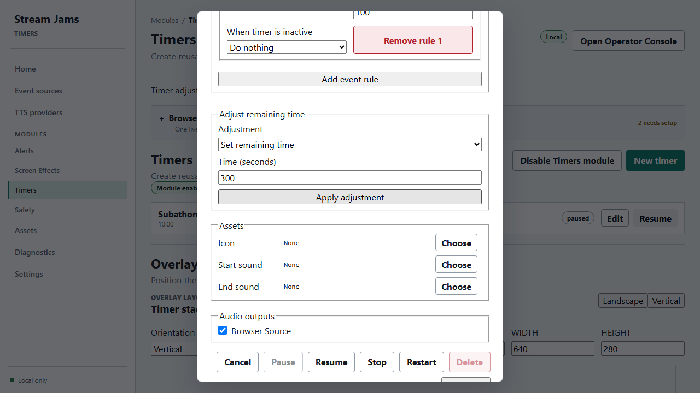
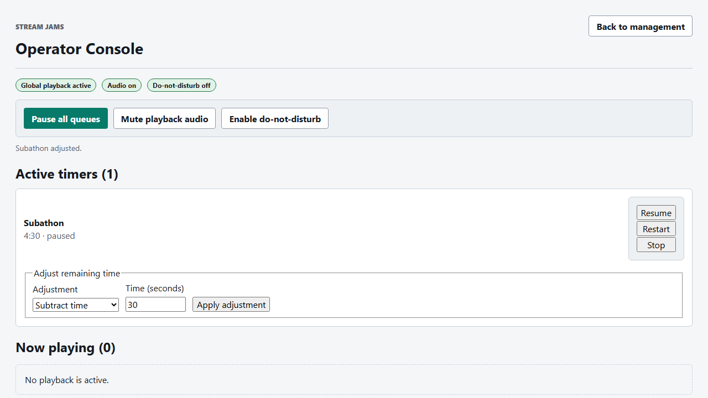

# Timers verification

Implementation checkpoint: September 29, 2026. This is local implementation and automated acceptance evidence for `add-timer-overlay-module`; it is not a published release or physical Stream Deck certification.

## Verified behavior

- Reusable Timer definitions persist with stable IDs, duration, optional icon/start/end assets, Browser Source output, and explicit named-device routes. Active running, paused, and completed generations remain memory-only and are empty after runtime restart.
- One active generation is admitted per definition. Start is retry-safe; pause, resume, stop, and restart preserve immutable admitted snapshots, and completion remains visible at zero for three seconds.
- Completed timers sort first, running timers sort by soonest completion, and paused timers sort below running timers by remaining duration. Landscape and Vertical profiles independently support horizontal or vertical equal slots, bounded capacity, truncated labels, and a `+N more` badge.
- Browser module/unified output and the native desktop module render normalized Timer snapshots. Surface visibility hides visuals without changing timer state. Start/end cue admission uses explicit Browser Source and/or named-device destinations.
- The dedicated loopback HTTP bearer supports discovery plus start, pause, resume, stop, and restart. Rotation immediately invalidates the prior bearer; revocation disables it; browser-origin, invalid-bearer, malformed, and authoring-override requests are rejected.
- Portable configuration includes definitions, layouts, assets, and route references while excluding active generations and Timer automation verifier material. Restore starts Timers idle and requires a new automation credential.

## Exact acceptance fixtures

The served-browser management fixture used Timer ID `timer-paws`, icon `icon-paws`, start cue `audio-start`, end cue `audio-end`, and named route `speakers`. It saved Landscape as horizontal with capacity 4 and Vertical as vertical with capacity 2, reloaded the definition, edited its label, and exercised start, pause, resume, restart, and stop.

The browser overlay fixture used Landscape horizontal capacity 3 and verified completed/running/paused ordering, equal card widths, ellipsis, `+2 more`, late join, and WebSocket reconnect continuity.

The final packaged desktop profile is retained at `C:\Users\James\AppData\Local\Temp\stream-jams-desktop-timers-FGVe8m`. Its definitions were:

| Timer ID | Label | Duration | Cue routes |
| --- | --- | ---: | --- |
| `timer_a579d247-8f64-45f5-8f6e-65329689c64f` | Long mitts timer | 120,000 ms | None; visual-only native lifecycle fixture |
| `timer_5a762984-405d-46bb-aec9-bf8292ee3578` | Short reward timer | 1,000 ms | None; visual-only native lifecycle fixture |

That run verified two simultaneous native cards, pause/resume/restart, the three-second completion hold, desktop layer hide/show, and bounded Quit while the long timer remained active. The owned service completed shutdown about 16 ms after `service-stop-requested`; Electron reached `electron-quit` about 53 ms after that request. The final packaged `app.asar` SHA-256 was `a2dfa12ced800bbc72685c3b7d9e70912827d9b830da15aff58e68617b47f61d`.

## Automated gates

Fresh final results:

- `corepack pnpm lint`: passed, including error-provenance validation.
- `corepack pnpm typecheck`: passed.
- `corepack pnpm test`: 274 Vitest files / 2,324 tests passed, followed by 22 Node script tests passed.
- `corepack pnpm build`: passed; production route budgets passed.
- `corepack pnpm build-storybook`: passed.
- `corepack pnpm test:storybook:ci`: 26 suites / 254 tests passed in Chromium. Storybook emitted only its existing Story Store deprecation warning.
- `corepack pnpm test:e2e`: 58 browser Playwright tests passed, including Timer management, overlay, and generic HTTP automation.
- `corepack pnpm test:desktop`: 25 non-hardware packaged desktop tests passed, including the Timer run above plus native SQLite/keyring, audio transport, overlay renderer, recovery/lifecycle, shutdown, and silent WebM/MP4 coverage.
- `git diff --check`: passed.
- `openspec.cmd validate add-timer-overlay-module --strict`: passed.

## Failures found and corrected

- The first packaged Timer Quit exposed that runtime cleanup closed the shared desktop overlay transport before clearing the Timer module snapshot. Cleanup now unsubscribes Timer output changes, drains the serialized sync tail, clears the module, and only then closes shared output transports. A lifecycle-aware runtime regression proves the ordering.
- The desktop supervisor initially rejected the final `sync-module` clear after entering `stopping`. It now permits only `stop`, `sync-module`, and `close` overlay lifecycle commands during shutdown; ordinary overlay work remains rejected. A supervisor regression protects the boundary.
- The first full unit run had three stale fixtures: two exact registered-module lists omitted Timers, and a synthetic migration rewind left migration 028 applied. Those fixtures were corrected; the clean rerun passed all 2,324 tests.
- The first browser Playwright run was 57/58 because an exact asset-usage label omitted the new module prefix. The assertion now expects `Alerts / ...`; the clean rerun passed 58/58.
- The first complete desktop run was 24/25 because its worker-only fixture acknowledged audio lifecycle RPCs but ignored overlay lifecycle RPCs. The fixture now acknowledges configure/sync/close only and still rejects playback; the clean rerun passed 25/25.
- Two final packaging attempts received HTTP 500 from GitHub's Electron `SHASUMS256.txt` endpoint after the Electron ZIP cache hit. A traced retry succeeded when the endpoint recovered. No dependency, mirror, checksum policy, or product code was changed to bypass verification.

## Remaining manual acceptance

- No physical Stream Deck button/profile was configured or pressed. The generic-client test exercised the same loopback HTTP contract against a real built local runtime without writing bearer values to artifacts, but physical Stream Deck UI acceptance remains outstanding.
- Browser and native desktop Timer rendering were verified in separate real renderers, not observed side-by-side in one packaged run. Packaged named-device audio, mute, missing-output, renderer recovery, and Timer cue routing have combined automated coverage, but a single integrated packaged Timer cue matrix remains outstanding.
- No audible physical-device, OBS mixer, or live-stream output was used. The desktop suite used silent media and isolated disposable profiles.

## PR #135 review corrections (September 29, 2026)

The follow-up addresses all ten independent-review findings:

- Asset replacement validates timer icon/audio roles before import mutation; backup reference preflight uses the same role validation.
- Restart commits its new generation before asynchronous cue cleanup. Stop cancels pending asset lookup and device preparation before they can admit late cues.
- Backup restore treats running, paused, and completion-hold timers as live playback; timer commands are blocked during maintenance.
- GIF icons are selectable and supported by the desktop asset resolver/transport.
- Management refreshes runtime state without replacing drafts; Operator reports timer-only refresh failures independently.
- API state and overlay projection share one comparator, including stable definition-ID ties.
- Desktop snapshots discard superseded asynchronous work, preserve revision tombstones, and acknowledge cancelled renderer loads. Surface-triggered refreshes use the serialized output queue.
- Asset usage links open the owning timer editor.
- Badge clearance is included in bounded rendering at profile edges, with identical card sizing before and after overflow appears.
- Rotating an existing automation credential requires explicit confirmation.

Focused regressions cover deferred interleavings, original asset preservation, GIF selection/resolution, blocked restore followed by a successful stopped restore, stale UI warnings, deep links, credential confirmation, and real browser edge geometry. The broader gate results above describe the earlier implementation checkpoint, not this follow-up run.

Follow-up validation:

- Final repository lint/typecheck, production build (including route budgets), Storybook build, OpenSpec strict validation, and whitespace checks passed.
- Focused lifecycle/restore regressions: 27 passed. Asset/GIF regressions: 85 passed. Desktop synchronization regressions: 54 passed. Management/Operator/routing/asset UI regressions: 51 passed. TimerStack unit tests: 9 passed; all four Timer browser tests passed.
- Full browser run: 57/60 passed. Two Operator fixtures omitted the timer-state endpoint and therefore unintentionally rendered the newly required stale-state warning; the healthy fixture now explicitly returns an empty timer list. Those three Operator tests plus the unchanged video/audio test that timed out on initial navigation all passed on a focused rerun (4/4). The original full run remains recorded as failed.
- Full Storybook run: 261/262 passed; the Assets replacement story timed out. Its six-story suite passed unchanged on a focused rerun. The original full run remains recorded as failed.
- The default full unit run encountered widespread Windows fork-worker teardown timeouts, including pure schema tests, and the Docker-helper child-process test timed out. The stalled run was stopped, not counted as green. A narrow thread-pool comparison passed the schema/helper tests (9/9).
- The full alternate local run, `node node_modules/vitest/vitest.mjs run --pool=threads --maxWorkers=1`, passed 275 files / 2,363 tests, followed by all 22 Node script tests. This diagnostic run used the system Node 24.15.0; the normal pnpm/CI toolchain remains pinned to 24.16.0, so it does not erase the failed default fork-run evidence.
- A separate rebuilt package preserved the user's open app. Native Timer lifecycle assertions passed, but the acceptance test failed its process-exit deadline after logging `electron-quit`. Evidence: `C:\Users\James\AppData\Local\Temp\stream-jams-desktop-timers-mrClgR`; packaged archive SHA-256 `8fa6045f2982e652c29d78e51abfd21522a515210956954710991a90246ad67f`. This is not a passing desktop acceptance run.

At the user's request, `windows-desktop` is now manual-only (`workflow_dispatch`), not an automatic PR/push CI job. Desktop tests, deadlines, and success-only artifact publishing remain intact. The CI YAML was parsed and its manual-only condition verified; the runbook documents the temporary change.

## Persistent event timers follow-up (2026-10-01)

Implemented saved event rules, SQLite runtime recovery, and authenticated manual remaining-time adjustments in Timers and Operator. Running timers checkpoint once per second, preserve time while closed, and reopen paused without a start cue. Graceful shutdown saves exact remaining time; a crash can preserve roughly one additional second under normal scheduling, with longer delay possible when checkpoints are delayed or fail. Existing event deduplication remains session-scoped; durable replay/history recovery is deferred.

Validation of the final implementation:

- Repository lint, typecheck, production build and route budgets passed.
- Full unit suite passed: 298 files, 2,578 tests. All 76 Node script tests passed.
- Storybook build and all 28 suites / 270 interaction tests passed.
- Six affected Playwright tests passed. After fixing the shared Operator styling import, the rebuilt real-service acceptance test passed again and its screenshot was reviewed.
- The real-service acceptance uses a disposable data directory and proves saved cheer rules, idle no-op, duplicate-event suppression, manual set/subtract, and paused recovery after closing/reopening the service. Unit coverage also verifies redemption matching, recovery checkpoints, safe adjustments, migrations, and API validation/authentication.
- Initial broad tests exposed two outdated persistence/migration fixture expectations, which were corrected, and two unrelated AlertEditor media-preview timeouts. Those two tests passed unchanged in isolation and in the final full run. The initial run remains failed evidence.
- OpenSpec strict validation and Git whitespace checks passed. No packaged desktop acceptance was run for this follow-up.

## Automated acceptance follow-up (2026-10-02)

The seven acceptance gaps identified after implementation now have automated coverage:

| Acceptance | Automated evidence |
| --- | --- |
| Forced process crash | `tests/e2e/persistent-timer-crash.spec.ts` kills an owned child without graceful close, reads its actual SQLite recovery row, and verifies exact paused restoration, no start cue, and no subsequent countdown. |
| Live overlay correction | `tests/e2e/persistent-event-timers.spec.ts` applies add/subtract/set through management controls and authenticated APIs while a real browser source is connected; Operator subtraction reaches zero and the completion hold disappears. |
| Event-rule matrix | `timer-runtime-coordinator.test.ts` exercises real rule dispatch/coordinator behavior for subscription/resubscription tiers, gift quantities and partial units, ordered restart/add, decrement, stop, idempotent start, and both idle alternatives. |
| Specific reward | The real-service browser acceptance authors Cat paws with a reward ID, rejects another reward, starts on a match, and preserves the active generation/deadline on a second matching redemption. |
| Persistence failures | Coordinator tests inject a checkpoint failure, verify diagnostic ownership and last-save recovery, and verify the next checkpoint succeeds. |
| Recovery edges | Coordinator tests preserve remaining time with missing retained media and suppress cues/icons; unit and real-service tests keep stopped/completed runs absent on reopen. |
| Correction failure UX | Timers and Operator tests retain input, display failure, re-enable Apply, and permit retry; a production-component Storybook scenario verifies Timers failure and success. |

The retry regression found and fixed a stale Timers error banner that remained visible after a successful correction.

Validation:

- Focused coordinator/Timers/Operator regression tests: 44 passed.
- Full Vitest run: 298 files / 2,587 tests passed.
- The combined `pnpm test` invocation failed afterward in one unrelated script test: a fixed 20 ms delay raced its asynchronous manifest write. That fixture now waits for an explicit stop-request boundary and controls native completion, retaining the original ordering and elapsed-time assertions. All 76 script tests passed in a subsequent complete script-suite run. The original combined invocation remains recorded as failed; Vitest was not needlessly rerun for a script-only repair.
- Storybook build and all 28 suites / 271 interaction tests passed, including accessibility and console gates.
- All nine affected Playwright tests passed; after tightening the live correction path to use UI controls throughout, the two real-runtime/crash tests passed again.
- Production build/route budgets, strict typecheck, lint, OpenSpec validation, and Git whitespace checks passed.

These tests use disposable profiles, a local browser source, and an owned child process. They do not require a live Twitch account or physical audio/desktop-overlay hardware.

Manual desktop acceptance (2026-10-02): the user resumed the isolated five-minute test timer, closed the desktop app, reopened the same test profile, and confirmed recovery worked. The reopen launcher used the newly built runnable Windows package. Existing live Twitch/Streamer.bot and OBS/overlay rendering were already validated and did not require repeat testing.

UI evidence from the disposable browser acceptance profile:

