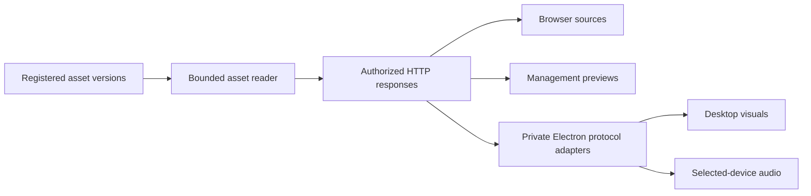

## Context

Design baseline: repository `bdfc085`, inspected September 30, 2026. The reported Screen Obscured variants use the same selected audio route and embedded-audio settings. Clean Screen (36,178,585 bytes) and Snowball (59,790,021 bytes) exceed the installed audio transport's 25 MiB cap; runtime logs report `Audio asset was not prepared`. Their visual paths succeed. Compressed copies are a workaround, not this architecture's acceptance fixture.

Current playback paths allocate complete bodies:

- `apps/server/src/http/routes/assets.ts` calls `assetStore.read`; `http/media-response.ts` slices the resulting Buffer for range responses.
- `modules/audio/desktop-audio-sink.ts` reads, hashes, and transfers whole media bodies. `apps/desktop/src/audio/player.ts` constructs Blob URLs.
- `modules/overlay-surfaces/desktop-visual-asset-resolver.ts` does equivalent reads for transient visuals and persistent timer icons; the web desktop controller owns Blob URLs.
- Management `AssetApi.getAssetFile` returns `response.blob()` because the management HTTP client uses bearer authentication.
- Asset replacements already get versioned storage names, but `AssetLibraryService.completeReplacement` immediately deletes the prior file.

The approved direction uses the existing loopback service, native media elements, and private Electron sessions. Existing queues, explicit device selection, authoring documents, mute/stop controls, and approximate synchronized onset are authoritative.

## Goals / Non-Goals

**Goals:** all accepted local media use bounded playback delivery; videos up to the existing 100 MiB import limit can supply device audio; all readers agree on an immutable version; authorization and cancellation survive repeated range requests; errors remain actionable and output-scoped.

**Non-Goals:** new codecs, remote media, LAN, higher import limits, upload/backup/probe pipeline rewrites, automatic extraction/transcoding, HLS/DASH/MSE players, frame-perfect synchronization, or production installation. Browser decoding and buffering remain implementation-dependent; this change bounds application transport buffers rather than promising constant total renderer memory.

## Decisions

### 1. One server-owned reader, HTTP delivery, and thin desktop adapters

The server remains the sole owner of repository lookup and media storage. Add a local-media service that resolves registered immutable versions and opens authorized reads through `LocalAssetStore`. Keep transport-neutral version/lifetime logic outside HTTP handlers. Core owns browser-compatible reference schemas; server owns filesystem handles and authorization state; desktop owns protocol adaptation and renderer lifetime.

Retain the existing authenticated management download and overlay URL contracts. Both use the new streaming reader. Add narrowly scoped media-grant routes for previews and desktop requests that cannot use those existing credentials. Do not create a general-purpose URL proxy.

Prefer the existing `@fastify/static` dependency for standard file delivery, using `serve: false` and explicit authorized routes rather than exposing the asset directory. Its `@fastify/send` implementation owns standard range/precondition handling and file streaming. Reuse Node streams and Electron protocol/fetch APIs for the remaining transport. Keep custom code limited to registered-version resolution, authorization, lifetime ownership, integrity policy, and thin adapters; do not build a parallel general-purpose HTTP response planner [R8-R9].

First verify that the installed library can satisfy the response contract, 64 KiB file-read buffering, cancellation, path confinement, and pinned-file identity requirements. Validate real resolved paths remain inside the asset root, including symlink/junction escape attempts. Inspection and delivery must refer to the same opened file identity; a path-based library API must not silently weaken this requirement. Where a documented gap requires direct handle ownership, use `FileHandle.createReadStream` with inclusive start/end offsets, narrowly scoped to that gap. Do not maintain a second range parser or precondition engine alongside the library. If the library cannot meet the contract through supported APIs, record the gap and revise the integration design before implementation proceeds with that path. Each request owns its reader and explicit offsets; never share a mutable file cursor across readers. Return/await Fastify stream responses and preserve backpressure through the Electron response body. No `readFile`, `Buffer.concat`, `blob()`, or `arrayBuffer()` in the playback delivery path.

Alternatives: direct desktop file access duplicates storage/security ownership; HLS/DASH/MSE introduces packaging and playback machinery unnecessary for local files and does not cover images; raising byte caps retains full-body memory amplification. Native streaming is supported by the existing frameworks [R1-R4].

### 2. Preserve native formats and define HTTP behavior once

Serve original PNG/JPEG/WebP/GIF/MP4/WebM/MP3/WAV/Ogg/audio-WebM bytes with their validated MIME type. Keep existing signature validation and import limits (image 10 MiB, GIF/audio 25 MiB, video 100 MiB). Container acceptance does not imply every embedded codec is playable.

Delegate standard HTTP behavior to the established file-serving library. The application integration must satisfy this response contract:

- Authorized full GET: 200 with exact Content-Length, MIME type, strong checksum-based ETag, `Accept-Ranges: bytes`, and `nosniff`.
- Authorized single closed/open-ended/suffix range: 206 with exact Content-Range and interval length.
- Valid unsatisfiable range: 416 with `bytes */length` and no file body.
- HEAD: full-representation headers, no body read, Range ignored.
- Malformed, unsupported-unit, or multiple ranges: ignore Range and stream the full representation, matching current policy.
- If-Range: matching strong ETag permits a range; weak/nonmatching tags or dates without a strong date validator cause full delivery. No Last-Modified validator is advertised initially.
- If-None-Match: matching authorized GET/HEAD returns 304 before body reads; authorization always runs first. Standard precondition precedence is covered by contract tests.
- `Cache-Control: no-store`, no response compression/transformation, and `Referrer-Policy: no-referrer` for capability responses.

Verify the library's header parsing and range arithmetic against malformed/overflow inputs through integration tests. Configure validators and headers through supported APIs; do not assume generated ETags are cryptographic checksums or that the library's `immutable` cache directive makes files immutable. Forward only necessary request/response headers through desktop adapters. A failure before headers uses the normal safe error envelope; a failure after headers closes the body and emits a correlated diagnostic rather than injecting JSON into media bytes. RFC 9110 defines range/validator behavior [R3].

### 3. Version identity and lifetime are independent of access credentials

A pinned version records asset ID, existing storage version/path internally, checksum, MIME type, size, and duration snapshot. Browser-visible descriptors never include paths. Access grants reference pinned versions; they do not own copies of file bytes.

Pin transient media at the same admission boundary that captures content and duration, using metadata only. This refines the discussion's preparation-time pin: a queued occurrence must not combine its admitted duration with a replacement's bytes. Resolve and verify the pinned file during preparation, not while matching triggers. Failed/rejected admission releases any acquired pins. Existing bounded queues bound queued ownership; skip, purge, terminal failure, and completion release it.

Persistent timer/module media is pinned by module presentation revision. Acquire a new revision before releasing the old one; layer visibility/reordering alone does not revoke it. Preview ownership starts when its descriptor is requested and ends when the preview releases it or expires.

Replacement commits new metadata/storage while existing pins retain the previous version. New admissions/previews use the replacement. Replacement cleanup defers deletion until no pins and no active reads remain. Deleting a current unused asset still requires the existing user action; cleanup applies only to explicitly retired versions.

Persist a small retirement journal under the managed asset store before replacement metadata can orphan an old file. On restart, reconcile journal entries against current repository storage paths; never delete a current referenced path. Restart invalidates transient grants, so retired versions can be cleaned after reconciliation. Failed replacement leaves the authoritative version protected. Interrupted deletion is retried idempotently. Unknown files are not deleted by a broad directory sweep. Backup/restore invalidates ownership and reconciles retirement before issuing new grants.

### 4. Preserve integrity without retaining full bodies

Desktop preparation currently verifies SHA-256 before handing media to the player. Keep that check as a cancellable incremental hash over bounded chunks, coalesced for consumers of the same pinned version within a preparation group. Compare size and file identity before/after verification, and reject a changed/missing file. Do not substitute a late streaming hash that detects corruption only after bytes have already played.

Do not add an application media cache or retain successful checksum results for reuse by later preparation groups. Every new preparation group performs its own verification. Sharing an in-flight verification among that group's destinations only avoids duplicate simultaneous work; it does not cache validation for subsequent playback. Operating-system file caching remains outside application control.

After verification, application-managed versions are immutable for their lifetime; opened reads validate the pinned identity. Changed size/identity/timestamps invalidate readiness and fail the affected recipient. This does not promise protection against an external process deliberately modifying a file in place while concealing all identity changes. A cold verification reads the full file from disk, but does not allocate or transfer its full body. Retain the existing preparation deadline; slow storage fails with a stage-specific error rather than unbounded waiting.

The present buffer path plays the exact bytes that passed verification. The proposed streaming path verifies first and reads again later, so its initial checksum alone does not prove that every subsequent range remains identical. Its continued integrity depends on managed version immutability and change detection. This distinction must remain explicit in documentation and acceptance evidence; the check is not malware scanning or proof of source authenticity.

### 5. Desktop renderers receive scoped references

Version the private IPC contracts. Replace bulk assets with strict references containing asset ID, version, MIME type, size, and an opaque handle bound to worker generation, recipient, and occurrence/module revision. Reject old byte-bearing payloads and incompatible protocol versions with a clear host capability error; packaged components upgrade together.

Server-to-main grant credentials stay in the trusted host registry. The renderer receives only its private-origin handle. Main registers media handlers in the existing isolated sessions:

- `stream-jams-audio://player/media/<handle>`
- `stream-jams-overlay://surface/media/<handle>`

Handlers accept GET/HEAD for issued handles only, build a URL from the trusted owned-service origin and fixed route, attach the internal read grant, reject redirects, and return the response body as a stream. Never accept caller-supplied hostnames, filesystem paths, or management tokens. Bind handlers to the owning session/generation and cancel them on destruction/service loss. Same-origin `media-src 'self'` and overlay `img-src 'self'` allow media while `connect-src` and navigation remain restrictive; do not enable CSP bypass or general renderer networking.

Keep private protocol registration `standard`, `secure`, and `stream` privileges, with handlers registered on the actual player session [R4]. Same-origin delivery also protects the existing Web Audio gain path from CORS-tainted media silence [R5]. Verify the forwarded Response is classified correctly by the packaged Electron runtime; documentation alone is not acceptance evidence.

### 6. Preview grants use the existing management session

Add protected create/renew/release operations through the typed management client, including existing CSRF/origin checks for mutations. A grant authorizes only GET/HEAD of one pinned asset version and is bound to the issuing session. Media elements use a same-origin URL containing a random, at least 256-bit opaque read token; never the management bearer token.

Use a five-minute sliding expiry renewed every minute while a preview owns the resource. Renewal keeps the same URL and version to avoid restarting media. Revocation, session invalidation, preview teardown, or expiry cancels its open reads and rejects subsequent ranges. Background timer throttling can allow expiry; reacquire through an authenticated request when the preview becomes active, report/recover locally, and never trigger live outputs. Release is idempotent; expiry handles abandoned tabs.

Do not persist, export, log, or place read tokens in diagnostics/Storybook fixtures. Redact the dedicated route segment in access/error logging before deployment. Browser-source route keys keep their existing authorization; add version identity to normalized media references so every range within an occurrence addresses its pinned version. A copied browser-source URL remains unchanged. Unimported local File previews may retain local Blob URLs because those are not fetched server assets.

### 7. Bound resources and preserve playback semantics

Initial shared limits: 256 active media response streams, 64 KiB application file-read buffers, and 4,096 live access grants. Existing queue, instruction, layer, and destination cardinality limits continue. Per-owner grants are deduplicated by pinned asset version; do not create a grant per range request. At capacity, reject new reads/grants with a bounded unavailable result, retain active owners, and surface actionable diagnostics. These limits bound server file buffers to 16 MiB plus framework/protocol overhead; they do not claim a 16 MiB total-process ceiling. Expose active reads/grants and bytes served to tests/diagnostics without per-frame logs.

Cancellation propagates renderer -> protocol -> HTTP -> file stream. Stop/skip/close pauses media, detaches its source, cancels reads, and releases handles. Revocation alone cannot silence already-buffered media: retain current authoritative mute and destructive host-stop fallback. A shared file-version pin survives while any healthy selected recipient still needs it.

Preparation retains the actual elements until the coordinator schedules a near-future common start. Readiness means enough decoded data to begin, not complete download. Keep normal-speed start from zero, onset-anchored durations/fades, existing bounded preparation/start/stall/completion policies, device deduplication, no fallback routing, and transparent visual failures. Hiding/re-showing existing visual content follows the current remainder-only rule rather than starting a new occurrence. Images/GIFs use native element readiness; this work does not add frame-accurate GIF timing.

## Risks / Trade-offs

- Private protocol range forwarding, cancellation, and Web Audio classification differ by Electron version -> packaged acceptance gate before finalizing the desktop slice; no silent fallback to whole-body transfer.
- Browser/decoder buffering can grow with resolution, bitrate, and concurrent layers -> measure host/server and renderer separately; prove absence of application full-body transfers rather than promising constant browser memory.
- Cold checksum verification or poorly indexed media can delay startup -> incremental verification, coalescing, existing deadlines, actionable errors, and beginning/end-index MP4 fixtures. Automatic remuxing is outside scope [R6].
- Asset replacement now retains old versions temporarily -> bounded owner lifetimes, durable retirement journal, retryable cleanup, and Windows replacement/delete tests.
- Capability URLs are bearer credentials -> narrow scope, session ownership, expiry/release, no-store, redaction, and no-referrer.
- Security depends on app-managed immutability and path confinement -> identity checks and explicit tamper tests; do not infer trust from a URL or checksum string alone.

## Migration Plan

1. Shared delivery slice: reader/HTTP semantics, version pins and retirement, reference/lease schemas, unchanged existing browser URLs; old desktop byte transport still works during this intermediate slice.
2. Desktop slice: validate protocol behavior, switch both audio and visual delivery (including timer icons) to references, remove obsolete audio/batch byte caps and Blob transfer ownership, retain an explicit incompatible-runtime diagnostic.
3. Preview/acceptance slice: switch registered previews across Assets, Alerts, Screen Effects, and Timers; verify every format/output and document measured memory/onset/cancellation evidence.

Each slice is independently reviewed/tested; fetch current origin/main and reconcile prior completed changes before implementation. Keep existing databases and asset IDs usable. Rollback means reinstalling the prior complete package after clean shutdown, preserving current asset records and files; older code may ignore the retirement journal and retain extra old files. Do not downgrade a mixed running host/server or roll back by deleting media. No production upgrade is authorized by this design.

## Validation And Delivery Gates

- Unit/inject: ranges and all response headers; HEAD/304 no body reads; auth before size disclosure; invalid paths/reparse escapes; grant scopes/capacity/expiry/renewal; version pin/replacement/purge; journal interruption/restart; failure before/after headers; cancellation closes all readers.
- Real HTTP: seek a real media element against the rebuilt service; simulate a slow/disconnected reader; prove backpressure and bounded buffers. Request a small range of a 100 MiB fixture and assert interval reads only, separately accounting for optional preparation hashing.
- Browser/management: every accepted format in applicable previews/overlays, unchanged silence semantics, no fetch-to-Blob for registered previews, session expiration, version replacement, and persistence of stable media elements during renewal.
- Packaged Windows: original large effects and generated redistributable equivalents; transparent VP9; MP4 with beginning/end metadata; trackless video; explicit audio, two devices, >100% gain, global mute/stop, management hidden, timer icons, host/service loss, rapid skip, and bounded Quit.
- Evidence: bytes transferred over IPC do not scale with media file size; no full-media buffer creation in playback paths; active streams/grants return to baseline; compare cold/warm prepare time, observed onset skew, server/host external memory, and renderer memory for 1/25/100 MiB fixtures with identical dimensions/codec workload where practical. Do not bundle private source media into the repository.
- Run affected package tests/typecheck and current repo/frontend gates for changed surfaces. Complete required lint/build/Storybook/Playwright and packaged acceptance before publishing a complete change. Physical OBS/device evidence must name the runtime and devices; missing physical coverage leaves that gate explicitly incomplete.

## Research And Evidence

Sources reviewed September 30, 2026. These establish API feasibility, not tested behavior of this proposed implementation.

- **R1:** [Node 24 FileHandle.createReadStream](https://nodejs.org/docs/latest-v24.x/api/fs.html#filehandlecreatereadstreamoptions): positional range reads and bounded stream buffering.
- **R2:** [Fastify stream replies](https://fastify.dev/docs/latest/Reference/Reply/#streams): native Node/Web stream response support.
- **R3:** [RFC 9110 range requests](https://www.rfc-editor.org/rfc/rfc9110.html#name-range-requests) and [If-Range](https://www.rfc-editor.org/rfc/rfc9110.html#name-if-range): representation identity, partial responses, and validator semantics.
- **R4:** [Electron protocol](https://www.electronjs.org/docs/latest/api/protocol), [net](https://www.electronjs.org/docs/latest/api/net): session-specific handlers, streaming scheme privilege, and streaming fetch responses.
- **R5:** [Web Audio cross-origin security](https://www.w3.org/TR/webaudio/#MediaElementAudioSourceNode-security): a CORS-cross-origin MediaElementAudioSourceNode must output silence.
- **R6:** [FFmpeg MP4 layout](https://www.ffmpeg.org/ffmpeg-formats.html): faststart moves the MP4 index; useful optimization, not required automatic transcoding.
- **R7:** [W3C MSE byte-stream registry](https://www.w3.org/TR/mse-byte-stream-format-registry/): MSE's format-specific streaming machinery is unnecessary for this native multi-format asset delivery use case.
- **R8:** [@fastify/static](https://github.com/fastify/fastify-static): existing direct dependency; explicit `sendFile` calls with directory serving disabled, configurable headers, and delegated range delivery.
- **R9:** [@fastify/send](https://github.com/fastify/send): underlying file streaming, byte ranges, and conditional requests. Prefer the existing wrapper; declare a direct dependency only if direct use has a demonstrated integration benefit.

## Open Questions

The library integration must establish whether supported APIs meet the pinned-file identity and exact HTTP contract before implementation of shared delivery. The protocol, gain, physical-output, and memory gates above are empirical acceptance conditions; a failed gate requires a scoped design revision rather than an unapproved transport/security fallback. Library reuse does not change the integrity policy in decision 4 or introduce caching.
